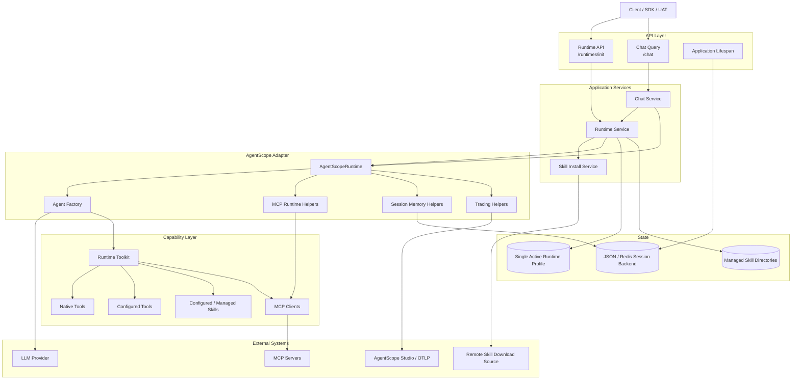
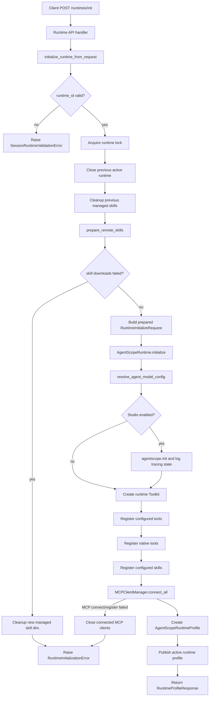
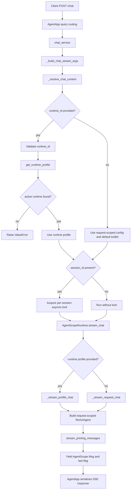
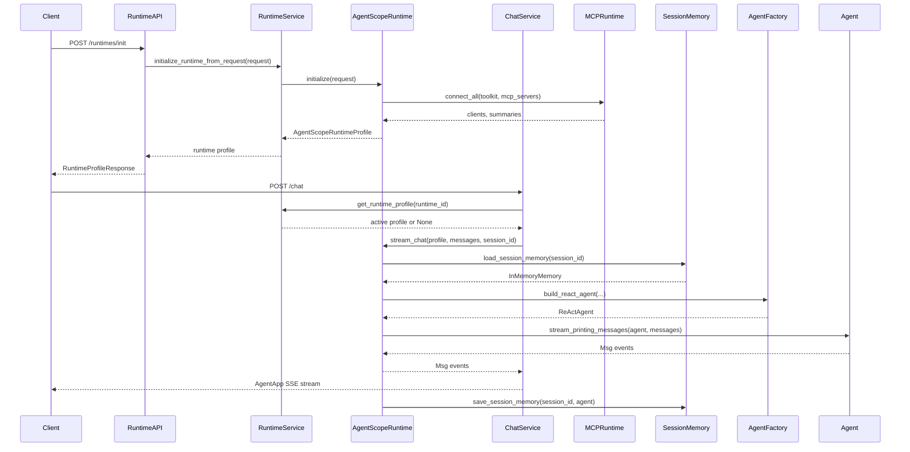

# Runtime Architecture

This document describes the current `/runtimes/init` and `/chat` execution flow. The service is built on `agentscope_runtime.engine.AgentApp`: `/runtimes/init` is registered as an explicit HTTP route, while `/chat` is registered through `AgentApp.query(framework="agentscope")`.

## System Components

## Directory Responsibilities

| Path | Responsibility |
| --- | --- |
| `src/main.py` | Creates the `AgentApp`, registers `/chat` and `/runtimes/init`, and starts the app when run directly. |
| `src/api/runtime.py` | Exposes `/runtimes/init` and maps runtime service exceptions to HTTP responses. |
| `src/api/lifecycle.py` | Validates startup dependencies such as session storage and closes runtime/session resources on shutdown. |
| `src/application/runtime_service.py` | Owns the single active runtime profile, runtime lock, managed skill cleanup, and initialization error normalization. |
| `src/application/chat_service.py` | Adapts AgentApp chat requests, validates `runtime_id`/`session_id`, serializes same-session streams with locks, and calls `AgentScopeRuntime.stream_chat`. |
| `src/application/skill_install_service.py` | Downloads and prepares remotely managed skills before runtime initialization. |
| `src/adapters/agentscope/runtime.py` | Orchestrates AgentScope runtime initialization and per-request chat streaming. |
| `src/adapters/agentscope/agent_factory.py` | Builds request-scoped `ReActAgent` instances and memory compression config. |
| `src/adapters/agentscope/mcp_runtime.py` | Creates, connects, registers, summarizes, and closes MCP clients. |
| `src/adapters/agentscope/session_memory.py` | Loads and saves AgentScope memory through the configured session backend. |
| `src/adapters/agentscope/tracing.py` | Handles AgentScope tracing setup, session context binding, warning filtering, and trace flushing. |
| `src/config/settings.py` | Loads environment-backed settings with snake_case Python fields and uppercase environment aliases. |
| `src/config/schemas.py` | Defines API request/response models plus `AgentModelConfig` resolution from request overrides and environment defaults. |
| `src/capabilities/schemas.py` | Defines tool, skill, skill download, and MCP capability declaration models. |
| `src/tools/` | Defines local deterministic tools, native file/shell tools, and the tool registry. |
| `src/runtime/skill_runtime.py` | Registers configured AgentScope skills and builds skill summaries. |
| `src/sessions/backend.py` | Selects and caches the JSON or Redis session backend. |
| `src/integrations/skill_api_client.py` | Downloads and extracts remote skill ZIP archives. |

## Configuration Model

`Settings` uses snake_case attributes in Python while preserving uppercase environment variable names through Pydantic aliases.

Examples:

| Python field | Environment variable |
| --- | --- |
| `settings.model_name` | `MODEL_NAME` |
| `settings.model_api_key` | `MODEL_API_KEY` |
| `settings.model_base_url` | `MODEL_BASE_URL` |
| `settings.port` | `PORT` |
| `settings.session_backend` | `SESSION_BACKEND` |
| `settings.studio_enabled` | `STUDIO_ENABLED` |

Request-level model overrides are accepted as `AgentConfig` and resolved into an `AgentModelConfig` by `resolve_agent_model_config()`. Runtime profiles store the resolved config so initialized runtimes reject per-chat `agent_config` overrides; callers must reinitialize the runtime to change model settings.

## Runtime Initialization Flow

`/runtimes/init` prepares a reusable runtime profile. It creates a runtime-owned toolkit and capability registry, but it does not create a `ReActAgent`; agents are built per chat request.

### Runtime Error Mapping

The application service raises domain-specific errors and the API layer maps them to HTTP responses:

| Exception | Meaning | HTTP response |
| --- | --- | --- |
| `SessionRuntimeValidationError` | Invalid runtime id or invalid capability declaration such as an unknown tool name. | `400 Bad Request` |
| `RuntimeInitializationError` | Runtime setup failed after request validation, such as MCP initialization or remote skill download failure. | `502 Bad Gateway` |

`SessionRuntimeError` is the common base class for runtime service errors.

## Chat Flow

`/chat` is registered through `AgentApp.query(framework="agentscope")`. The chat service receives AgentScope messages and an optional request object, resolves the runtime context, serializes streams for the same `session_id`, and delegates actual execution to `AgentScopeRuntime.stream_chat()`.

### Profile Chat Path

When a request includes `runtime_id`, chat execution uses the active `AgentScopeRuntimeProfile`:

1. Reject per-chat `agent_config`; initialized runtimes use the model config resolved during `/runtimes/init`.
2. Load session memory through `load_session_memory(session_id)`.
3. Build a request-scoped `ReActAgent` with the profile toolkit, system prompt, and memory compression config.
4. Bind the AgentScope session context when `session_id` is present.
5. Stream agent messages through `stream_printing_messages()`.
6. Flush tracing when enabled.
7. Save session memory through `save_session_memory(session_id, agent)`.

### Request-Scoped Chat Path

When no runtime profile is supplied, chat execution uses request-scoped config and the default toolkit:

1. Resolve `AgentModelConfig` from request `agent_config` and environment defaults.
2. Load optional session memory.
3. Build a request-scoped `ReActAgent` with the default toolkit.
4. Stream messages, flush tracing when enabled, and save session memory if `session_id` is present.

## MCP Runtime Boundary

`MCPClientManager.connect_all()` owns the MCP lifecycle during runtime initialization:

1. Normalize each MCP declaration into an `MCPServerSummary`.
2. Create either `StdIOStatefulClient` or `HttpStatefulClient`.
3. Connect the client.
4. Register the client with the runtime-owned toolkit.
5. Return connected clients and summaries.
6. If any step fails, close already connected clients in reverse order and raise `MCPClientInitializationError`.

`AgentScopeRuntimeProfile.close()` later calls `close_mcp_clients()` to close initialized MCP clients in LIFO order.

## Session Memory

The session backend is selected by `settings.session_backend`:

- `json`: uses `JSONSession` with `settings.session_dir`.
- `redis`: uses `RedisSession` with `settings.redis_*` fields.

`chat_service` serializes concurrent streams sharing the same `session_id` with an in-process `asyncio.Lock`. `session_memory.py` then handles persistence:

- `load_session_memory(session_id)` always creates an `InMemoryMemory`; when `session_id` exists, it loads persisted state into that memory.
- `save_session_memory(session_id, agent)` persists `agent.memory` only when `session_id` is present, and logs save failures without failing the completed stream.

## Tracing

`tracing.py` isolates AgentScope tracing details from runtime orchestration:

- `suppress_agentscope_thinking_warnings()` installs a filter for noisy AgentScope thinking-block warnings.
- `log_tracing_state(context)` logs OpenTelemetry provider and span processor details for diagnostics.
- `bind_agentscope_session_context(session_id)` binds AgentScope run context for a single chat execution.
- `query_tracing_enabled()` reads `settings.studio_enabled`.
- `flush_tracing(trace_label)` calls provider `force_flush()` when available and logs final tracing state.

When `settings.studio_enabled` and `settings.studio_url` are set, `AgentScopeRuntime.initialize()` calls `agentscope.init()` with `studio_url`, `tracing_url`, and `run_id` equal to the runtime id.

## Lifecycle Summary

## Operational Notes

- Only one active runtime profile is kept per process. Reinitializing closes the previous runtime and removes managed skill directories no longer referenced by the active runtime.
- `/chat` with a `runtime_id` must target the active runtime id. If no matching runtime exists, chat resolution fails before agent execution.
- Initialized runtimes do not accept per-chat `agent_config`. Reinitialize the runtime to change model settings.
- UAT scripts generate unique UUID-based runtime/session ids to avoid stale JSON session files from previous runs.
