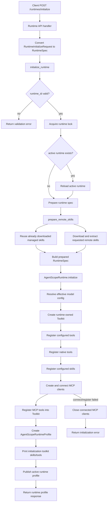
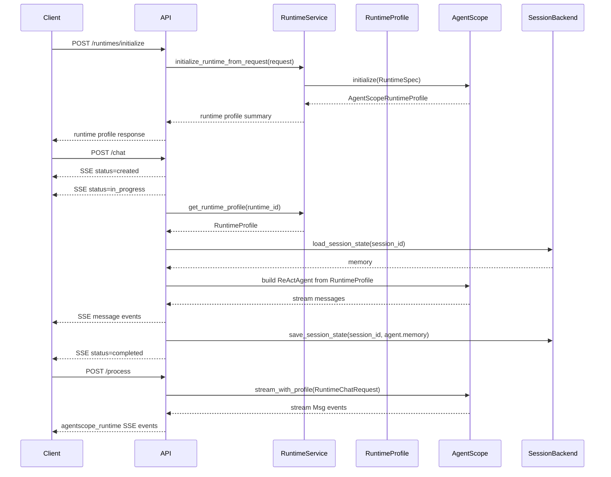

# Runtime Architecture

This document describes the current `/runtimes/initialize`, `/chat`, and compatibility `/process` execution flow.

## Runtime Initialization Flow

`/runtimes/initialize` prepares a reusable runtime profile. It does not create a `ReActAgent`. The agent is created later during `/chat`.

## Chat Flow

`/chat` receives user messages, finds the initialized runtime profile by `runtime_id`, creates a request-scoped `ReActAgent`, streams SSE events, and saves session memory after execution.

```mermaid
flowchart TD
    A[Client POST /chat] --> B[FastAPI validates ChatRequest]
    B --> C[chat_via_agentscope]
    C --> D[Convert ChatInput to ChatMessage list]
    D --> E[Return StreamingResponse event_stream]
    E --> F[Client starts reading SSE stream]

    F --> G[Validate session_id]
    G --> H[Yield status created]
    H --> I[Yield status in_progress]
    I --> J{valid session_id?}
    J -- yes --> K[Acquire per-session lock]
    J -- no --> L[Run without session lock]
    K --> M[_stream_chat_request]
    L --> M

    M --> N[Extract runtime_id and session_id]
    N --> O[get_runtime_profile runtime_id]
    O --> P{runtime profile found?}
    P -- no --> Q[Yield status failed]
    P -- yes --> R[Build RuntimeChatRequest]
    R --> S[AgentScopeRuntime.stream_with_profile]

    S --> T[Create InMemoryMemory]
    T --> U{session_id present?}
    U -- yes --> V[Load session memory from backend]
    U -- no --> W[Use empty memory]
    V --> X[Print chat toolkit skills/tools]
    W --> X
    X --> Y[Build ReActAgent with runtime config/toolkit/memory]
    Y --> Z[Bind AgentScope run context if session_id exists]
    Z --> AA[agent receives messages]
    AA --> AB[AgentScope may compress memory before reasoning]
    AB --> AC[LLM reasoning and tool execution]
    AC --> AD[stream_printing_messages yields agent messages]
    AD --> AE[Convert AgentScope Msg to ChatEvent]
    AE --> AF[Compute incremental text delta]
    AF --> AG[Yield SSE message event]
    AG --> AH{more stream events?}
    AH -- yes --> AD
    AH -- no --> AI[Flush tracing]
    AI --> AJ{session_id present?}
    AJ -- yes --> AK[Save agent.memory to session backend]
    AJ -- no --> AL[Skip session save]
    AK --> AM[Yield status completed]
    AL --> AM

    M -- exception --> Q
```

`/chat` owns the public SSE JSON shape. AgentScope stream messages may carry cumulative text in `Msg.content[0].text`; `/chat` tracks the previous text per `(role, name)` and emits only the newly added text in `delta.text`, `text`, and the first text block in `content`.

## Process Flow

`/process` is registered through `AgentApp.query(framework="agentscope")` for compatibility and comparison. It uses the same runtime execution path as `/chat`, but yields AgentScope `Msg` objects back to `agentscope_runtime` and lets that framework serialize the SSE stream.

```mermaid
flowchart TD
    A[Client POST /process] --> B[agentscope_runtime validates request]
    B --> C[Route to process_query registered by AgentApp.query]
    C --> D[_stream_process_messages]
    D --> E{valid session_id?}
    E -- yes --> F[Acquire per-session lock]
    E -- no --> G[Run without session lock]
    F --> H[_stream_process_messages_locked]
    G --> H

    H --> I[Extract runtime_id and session_id]
    I --> J[get_runtime_profile runtime_id]
    J --> K{runtime profile found?}
    K -- no --> L[Raise framework-handled error]
    K -- yes --> M[Normalize process Msg objects to ChatMessage list]
    M --> N[Build RuntimeChatRequest]
    N --> O[AgentScopeRuntime.stream_with_profile]

    O --> P[Create InMemoryMemory]
    P --> Q{session_id present?}
    Q -- yes --> R[Load session memory from backend]
    Q -- no --> S[Use empty memory]
    R --> T[Print chat toolkit skills/tools]
    S --> T
    T --> U[Build ReActAgent with runtime config/toolkit/memory]
    U --> V[Bind AgentScope run context if session_id exists]
    V --> W[agent receives messages]
    W --> X[AgentScope may compress memory before reasoning]
    X --> Y[LLM reasoning and tool execution]
    Y --> Z[stream_printing_messages yields agent messages]
    Z --> AA[Yield AgentScope Msg and last flag]
    AA --> AB{more stream events?}
    AB -- yes --> Z
    AB -- no --> AC[Flush tracing]
    AC --> AD{session_id present?}
    AD -- yes --> AE[Save agent.memory to session backend]
    AD -- no --> AF[Skip session save]
    AE --> AG[agentscope_runtime serializes SSE stream]
    AF --> AG
    AG --> AH[Client receives framework-provided SSE events]
```

When comparing `/chat` and `/process`, pass the same explicit `session_id`. If `session_id` is omitted, the `/process` framework layer may assign a generated session identifier, while `/chat` leaves it absent.

## Chat and Process Differences

Both endpoints execute the same agent runtime path: they resolve the runtime profile, build a `RuntimeChatRequest`, call `AgentScopeRuntime.stream_with_profile`, create a request-scoped `ReActAgent`, run `stream_printing_messages`, and persist session memory when a `session_id` is present.

The differences are at the HTTP boundary:

| Area | `/chat` | `/process` |
| --- | --- | --- |
| Registration | Explicit FastAPI route registered with `app.post("/chat")` | AgentScope runtime query route registered with `AgentApp.query(framework="agentscope")` |
| Request validation | Validated by the local `ChatRequest` Pydantic model | Validated and adapted by `agentscope_runtime` before `process_query` receives messages |
| Input normalization | Converts each `ChatInput` to the internal `ChatMessage` while preserving the original `content` shape | Normalizes incoming AgentScope `Msg` or message-like objects to `ChatMessage` |
| Session default | Leaves `session_id` absent when the caller does not provide it | The framework layer may assign a generated session identifier when omitted |
| Stream serialization | Local code converts `Msg` to `ChatEvent` and emits the public SSE JSON shape | `agentscope_runtime` serializes yielded `Msg` objects into SSE |
| Text delta behavior | Converts cumulative text chunks into incremental `delta.text`, `text`, and first text block values | Leaves stream serialization semantics to `agentscope_runtime` |

Use `/chat` as the stable public API when clients depend on a predictable SSE JSON contract. Use `/process` to compare against the framework-provided AgentScope stream behavior or to support callers that still use the runtime query endpoint.

## Lifecycle Summary

