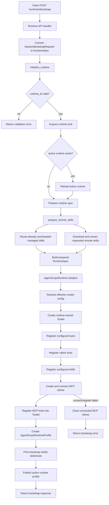
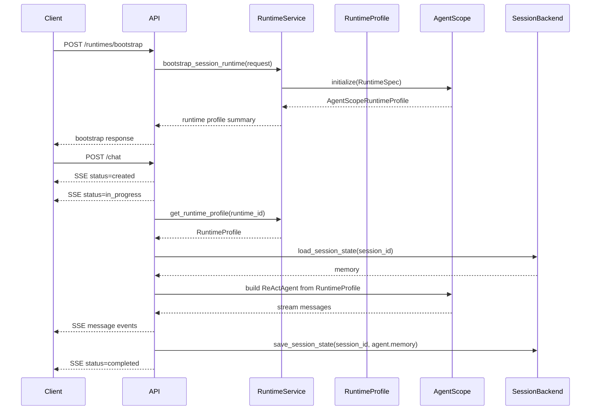

# Runtime Architecture

This document describes the current `/runtimes/bootstrap` and `/chat` execution flow.

## Bootstrap Flow

`/runtimes/bootstrap` prepares a reusable runtime profile. It does not create a `ReActAgent`. The agent is created later during `/chat`.

## Chat Flow

`/chat` receives user messages, finds the bootstrapped runtime profile by `runtime_id`, creates a request-scoped `ReActAgent`, streams SSE events, and saves session memory after execution.

```mermaid
flowchart TD
    A[Client POST /chat] --> B[FastAPI validates ChatRequest]
    B --> C[chat_via_agentscope]
    C --> D[Convert ChatInput to ChatMessage list]
    D --> E[Return StreamingResponse event_stream]
    E --> F[Client starts reading SSE stream]

    F --> G[Validate session_id]
    G --> H[Yield status created]
    H --> I[Yield status in_progress]
    I --> J{valid session_id?}
    J -- yes --> K[Acquire per-session lock]
    J -- no --> L[Run without session lock]
    K --> M[_stream_chat_request]
    L --> M

    M --> N[Extract runtime_id and session_id]
    N --> O[get_runtime_profile runtime_id]
    O --> P{runtime profile found?}
    P -- no --> Q[Yield status failed]
    P -- yes --> R[Build RuntimeChatRequest]
    R --> S[AgentScopeRuntime.stream_with_profile]

    S --> T[Create InMemoryMemory]
    T --> U{session_id present?}
    U -- yes --> V[Load session memory from backend]
    U -- no --> W[Use empty memory]
    V --> X[Print chat toolkit skills/tools]
    W --> X
    X --> Y[Build ReActAgent with runtime config/toolkit/memory]
    Y --> Z[Bind AgentScope run context if session_id exists]
    Z --> AA[agent receives messages]
    AA --> AB[AgentScope may compress memory before reasoning]
    AB --> AC[LLM reasoning and tool execution]
    AC --> AD[stream_printing_messages yields agent messages]
    AD --> AE[Convert AgentScope Msg to ChatEvent]
    AE --> AF[Yield SSE message event]
    AF --> AG{more stream events?}
    AG -- yes --> AD
    AG -- no --> AH[Flush tracing]
    AH --> AI{session_id present?}
    AI -- yes --> AJ[Save agent.memory to session backend]
    AI -- no --> AK[Skip session save]
    AJ --> AL[Yield status completed]
    AK --> AL

    M -- exception --> Q
```

## Lifecycle Summary

